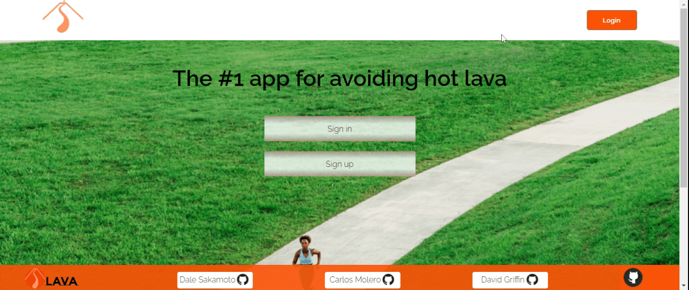
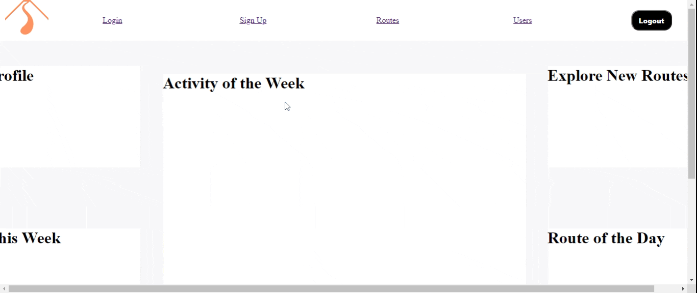
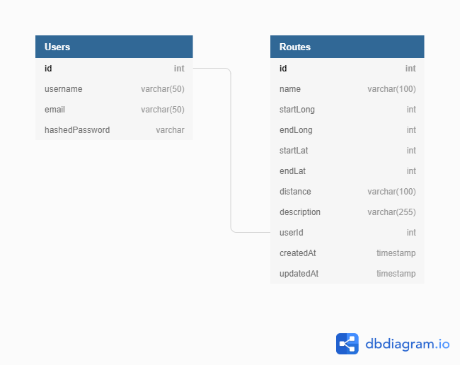

# [The Road Is Lava](https://theroadislava.herokuapp.com/) - The #1 app for avoiding hot lava
*By [David Griffin](https://github.com/davidleegriffin) [Carlos Monero](https://github.com/Cmolerov) [Dale Sakamoto](https://github.com/DaleTsakamoto)*

### [Table Of Contents]:
- [Description](https://github.com/Cmolerov/the_floor_is_lava#Description)
- [Application Architecture && Technologies Used](https://github.com/Cmolerov/the_floor_is_lava#Application-Architecture-&&-Technologies-Used)
- [Technology Shields](https://github.com/Cmolerov/the_floor_is_lava#Technology-Shields)
- [Frontend Overview](https://github.com/Cmolerov/the_floor_is_lava#Frontend-Overview)
- [Backend Overview](https://github.com/Cmolerov/the_floor_is_lava#Backend-Overview)

## [Description]:
The Road Is Lava is an exercise helper web app designed to shake things up when lava strikes ruin your favorite bike path and forces you on the fly to take a different route to achieve your fitness goals.

Get [MOVING!](https://theroadislava.herokuapp.com/).

### [Application Architecture && Technologies Used]:
The Road Is Lava was built using the python/flask framework with a PostgreSQL(postgres) database to serve up  RESTful API's in combination with REACT frontend framework.

### [Frontend Overview]:

### [Backend Overview]:

### [Example Sign-up]:

### [Example Login]:

### [Example of Site Navigation]
A display of various routes taken while navigating site

## [Relational Database Model]:
One of the larger challenges of this project was ensuring we had the right database setup. We tried to design it well enough to cover all of the usages we needed. This project was incredibly important to have the relations between tables setup properly.

The end database schema:  

### [Conclusion && Next Steps]:
Things learned while we worked on The Road Is Lava:
- Some issues are immensely simple, but after long hours of programming you miss them.
- More than one brain and one set of eyes is always better for debugging.
- Going back to the project with a fresh mind always helps.

Next Steps:

### [Technology Shields]:
            
